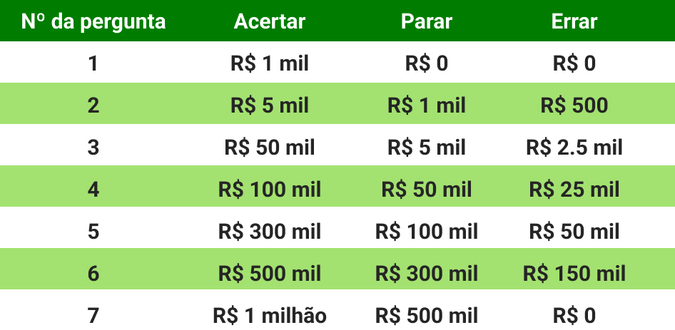

# DollarHead

DollarHead é um Jogo de perguntas e respostas onde o conteúdo é gerenciado pela comunidade de jogadores. O jogo permite aos usuários ampliação e teste dos seus conhecimentos, de forma simples e divertida. O gerenciamento das perguntas pela comunidade mantém as questões atuais e corretas, como ocorre em outros conteúdos geridos por comunidades com o Wikipédia. DollarHead é semelhante a sucessos como o Show do Milhão e Who Wants to Be a Millionaire?  

# Vídeo do projeto na versão DH.2
https://www.youtube.com/watch?v=uq4CiR-wNGQ&t=98s&ab_channel=Computa%C3%A7%C3%A3o-UFCCrate%C3%BAs   

# Regras e Funcionalidades
O objetivo é conseguir o prêmio de 1 milhão de dólares. As perguntas são de múltipla escolha com quatro alternativas. Em cada pergunta, o jogador poderá: responder a pergunta; parar de responder; errar a resposta; pedir a eliminação de duas respostas erradas; ou denunciar a pergunta por enunciado, alternativas ou resposta incorreta. O jogador poderá pedir a eliminação de duas respostas erradas uma única vez. Se responder corretamente, o jogador passa para a próxima pergunta. De acordo com a pergunta em que o jogador estiver, ele receberá um prêmio em dinheiro se o jogador responder corretamente, parar ou errar a resposta de acordo com a tabela:

  É possível criar uma conta própria de usuário. Após a criação é possível realizar a edição e a exclusão da mesma. 
Todo usuário é capaz de adicionar e editar questões por meio do painel de questões, sendo possível também denúnciar e validar as mesmas 1 vez por cada usuário. Uma questão passa a ser inválida quando recebe 3 denuncias. A mesma pode passar a ser válida caso receba 3 validações. A cada ação de adição, edição, dunúncia, validação e remoção de questões o usuário recebe uma contribuição. 
Existem níveis de usuários. Os níveis são 3: Indigente, Abundante e Rasga Moeda. Indigente é o nível inicial que todo usuário recebe ao criar uma conta. Caso o jogador atinja 20 contribuições, ele passa a ser um Abundante. Caso ele contabilize 50 contribuições passará a ser um Rasga Moeda. Usuários Abundates e Rasgadores de moeda podem validar e denunciar questões instantaneamente, ou seja, sua ação de denúncia e validação vale por 3. Além disso, jogadores Rasgadores de Moeda possuem autoridade de excluir questões e podem realizar a eliminação de duas alternativas duas vezes ao longo do jogo. 

Há uma aba na tela inicial denominada Hall da fama onde é possível ver o ranking dos usuários com melhor pontuação. Nela é possível também visualizar a data e a hora da jogada em questão. 

Em stats é possível visualizar as estatísticas do usuário atualmente logado. Informações como número de partidas jogadas, número de derrotas por erro, Número de derrotas por parada, Número de eliminações de duas alternativas, premiação total acumulada, número de contibuições e nível de usuário. Além disso há um gráfico que ilustra as 5 últimas partidas do jogador e a premiação recebida nas jogadas em questão. 

Há também uma aba onde o jogador pode visualizar as regras e as explicações das funcionalidades do jogo.  

# Documentação

Telas prototipadas no Figma: https://www.figma.com/file/izvhsbXeyZXbplkn5ZSQ4c/DollarHead?node-id=0%3A1  
Diagramas UML: https://github.com/SauloCav/DollarHead/tree/main/Documentation/diagramas%20UML  
Documentação do banco de dados: https://github.com/SauloCav/DollarHead/tree/main/Documentation/dataBase  
Projeto Base: https://github.com/SauloCav/Quizgame-PHP.git   

# How To

- Tendo o mysql e o PHP instalados, utilize o script do banco contido na pasta de documentação para criar o banco e as tabelas. 
- Abra o local host no seu navegador de preferência e escolha Dollarhead para iniciar. 
- Realize o cadastro do seu usuário e comece a jogar. 

Tutoriais, artigos e video aulas: 
How to Install the XAMPP Server for PHP and MySQL: https://www.youtube.com/watch?v=btauAEqaifw&ab_channel=DaveGray  
Installing Apache PHP MYSQL on Windows 10: https://www.youtube.com/watch?v=qpPYYX-i1cs&ab_channel=Aryans%26Sierra  
How to setup Apache, MySql, and PHP on Ubuntu Linux: https://www.youtube.com/watch?v=TrLAx27Npns&ab_channel=AlessandroCastellani  
PHP With MySQL Tutorial For Beginners: https://www.youtube.com/watch?v=nP-MvFoDVZE&ab_channel=Simplilearn  
Getting Started with PHP Applications: https://netbeans.apache.org/kb/docs/php/quickstart.html  
PHP Getting Started: https://www.tutorialrepublic.com/php-tutorial/php-get-started.php  
MySQL Tutorial for Beginners: https://www.youtube.com/watch?v=7S_tz1z_5bA&t=1282s&ab_channel=ProgrammingwithMosh   
